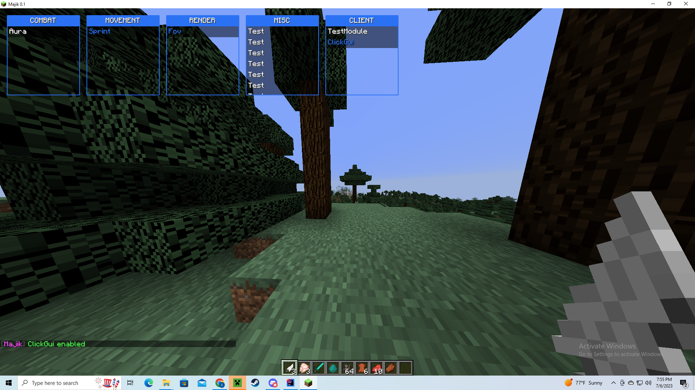

# Majik Base
a forge 1.12.2 base client for you skidders.
Contact : canonball90

## Features
- Clickgui
- Setting System
- Colorpicker (in the future)
- mixins
- hooks
- config system

**Client**

this is an old screenshot btw

## Credits

- [enokitoraisu](https://github.com/enokitoraisu/ClickGui-Example/tree/main)
for click gui base
- [Winter](https://github.com/pvpb0t/Winter/blob/main/build.gradle)
for build.gradle file
- [MrsRina](https://github.com/MrsRina/Turok-Framework/tree/main)
for turok framework
- [Me](https://github.com/Canonball90)
for making this nutty base
